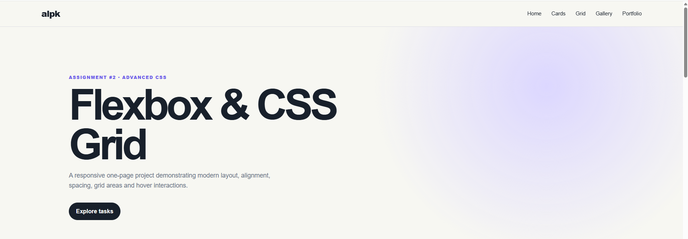
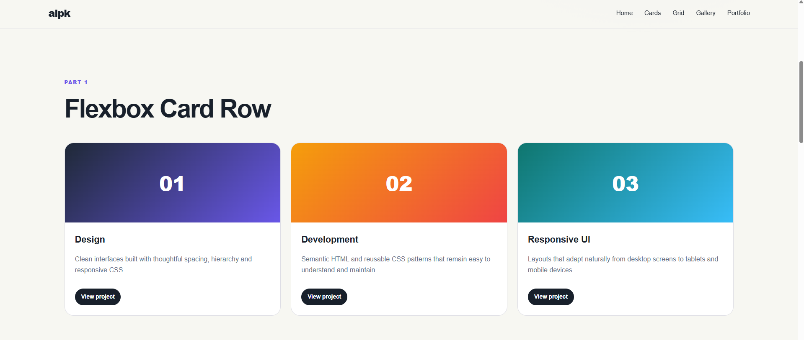
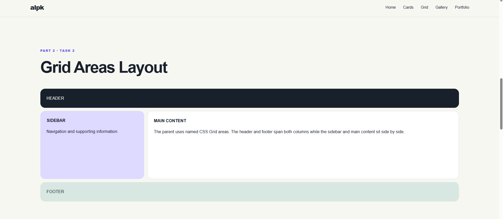
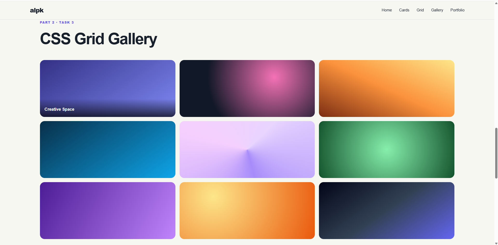
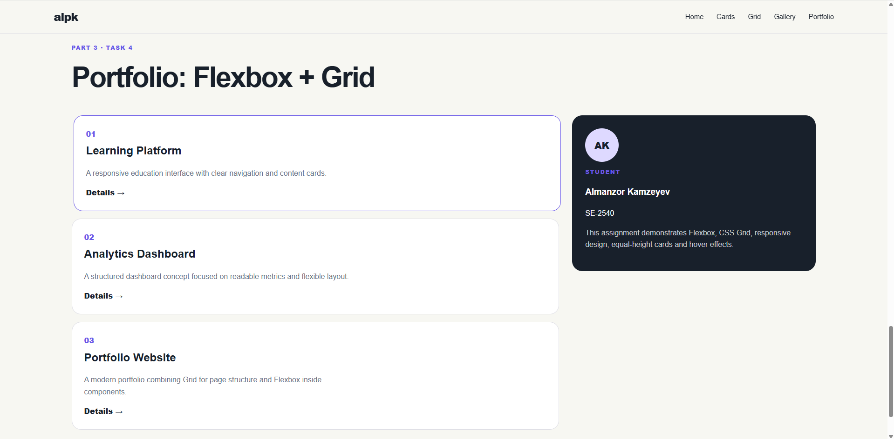

# Assignment #2 — Advanced CSS (Flexbox & Grid)

**Student:** Almanzor Kamzeyev  
**Group:** SE-2540

## Project Description
This project demonstrates advanced CSS layout techniques using **Flexbox** and **CSS Grid**. It is responsive and does not use external CSS frameworks.

## Part 1 — Flexbox

### Task 0: Navigation Bar
- Logo is placed on the left and navigation links on the right.
- The header uses `display: flex`.
- `justify-content: space-between` separates the logo and navigation.
- `align-items: center` vertically centers the content.
- `gap` creates consistent spacing between navigation links.

**Screenshot:**  

### Task 1: Card Row
- Three cards are placed in one Flexbox container.
- Each card contains a visual, title, description, and button.
- `align-items: stretch` and flexible card content keep cards equal in height.
- `gap` provides consistent spacing.
- Hovering a card adds lift and shadow effects.

**Screenshot:**  
_

## Part 2 — Grid System

### Task 2: Page Layout with Grid Areas
The example uses named areas for `header`, `sidebar`, `main`, and `footer`. The header/footer span the complete layout, while sidebar/main occupy separate columns.

**Screenshot:**  

### Task 3: Image Gallery
- The gallery contains nine visual items.
- CSS Grid creates equal-width responsive columns.
- `gap` creates consistent spacing.
- Each item has a caption overlay shown on hover.

**Screenshot:**  

## Part 3 — Combining Flexbox & Grid

### Task 4: Portfolio Page
- The page header/navigation uses Flexbox.
- The portfolio section uses CSS Grid for projects + sidebar.
- Each project card uses Flexbox internally.
- The page footer spans the full page width.
- Media queries adapt the layout for tablets and phones.

**Screenshot:**  

## Work Process Summary
I first created semantic HTML sections for every assignment task. I used Flexbox for one-dimensional layouts such as navigation, card rows, and content inside project cards. I used CSS Grid where both rows and columns were important, especially the named-area layout, gallery, and portfolio section. Finally, I added hover transitions and media queries to make the website interactive and responsive.

## How to Run
1. Download or clone this repository.
2. Open the project folder.
3. Open `index.html` in a browser, or use the Live Server extension in Visual Studio Code.

## Files
- `index.html` — HTML structure and content.
- `styles.css` — Flexbox, Grid, responsive rules, colors, spacing, and hover effects.
- `screenshots/` — place screenshots required for the report here.
